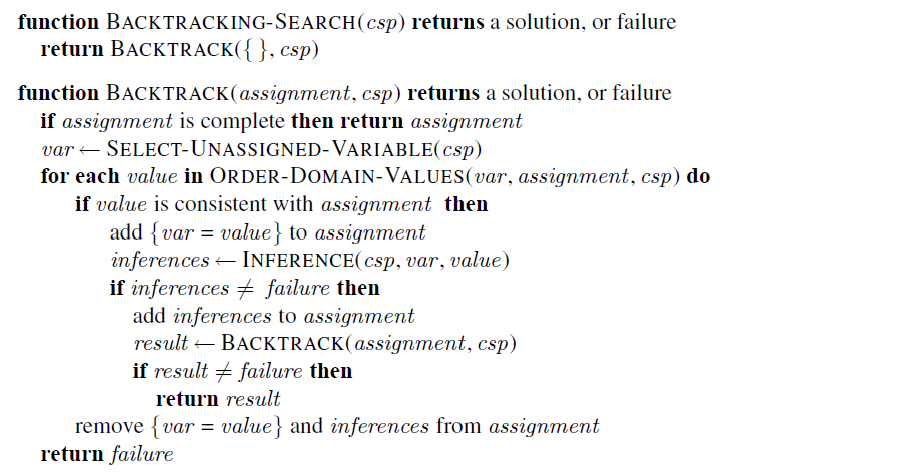
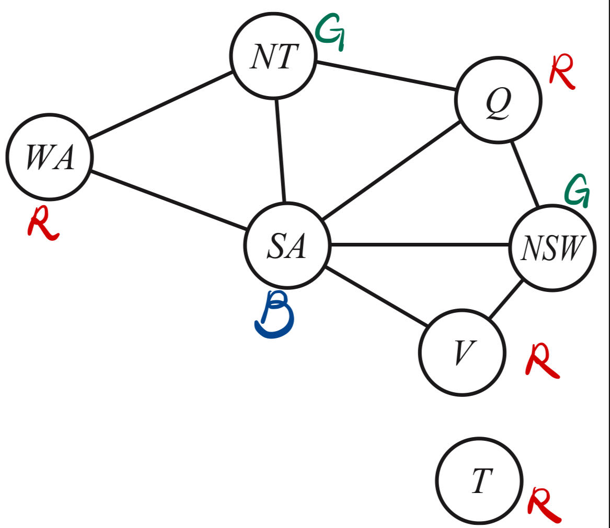

# CSP

### 1. Backtracking solver

Below is my backtracking solver following the idea of the textbook



```python
def backtrack(self, variable=None):
    # If all variables have been assigned values, return True
    if all(val != -1 for val in self.assignment):
        return True
    
    # Variable selection based on MRV heuristic
    variable = self.select_mrv_variable() if self.use_mrv else (variable if variable is not None else 0)
    
    # Value ordering based on LCV heuristic
    ordered_domain_values = self.order_domain_values(variable) if self.use_lcv else self.domains[variable]

    for value in ordered_domain_values:
        if self.is_valid_assignment(variable, value):
            self.assignment[variable] = value

            # Store the original domains for all variables so they can be restored later if needed.
            saved_domains = {var: self.domains[var].copy() for var in self.domains}
            self.domains[variable] = [value]

            # Before diving deeper into the search, we first attempt to prune the domains of the variables 
            initial_queue = []
            for neighbor in range(self.num_variables):
                if neighbor != variable:
                    if (neighbor, variable) in self.constraints:
                        initial_queue.append((neighbor, variable))
                    elif (variable, neighbor) in self.constraints:
                        initial_queue.append((variable, neighbor))

            if not self.use_inference or self.ac3(initial_queue):

                # Recursively try to assign values to the next variables
                if self.backtrack(variable + 1):

                    # If the recursive call returned True, all subsequent variables have valid assignments
                    # So, return True
                    return True
                
            # If the recursive call returned False, reset the 'variable' assignment to -1
            # and try the next value from the domain
            self.domains = saved_domains
            self.assignment[variable] = -1

    # If no value from the domain can be assigned to the 'variable', return False
    return False
```

### 2. Map-coloring framework and tests



I create a `map_coloring_csp` class inherits from a general `ConstraintSatisfactionProblem` class, and it specializes in solving map-coloring problems. In the initialization process, territories and colors are mapped to integer representations for easier computation. The constraints, which indicate which territories are adjacent and shouldn't have the same color, are translated from string pairs to pairs of integers and color combinations. This conversion ensures that territories do not share the same color with their neighbors. I then set up a CSP for the Australian map where territories such as Western Australia (WA), Northern Territory (NT), Queensland (Q), etc., need to be colored with three colors: red, green, and blue, in such a way that no two neighboring territories share the same color.
```python
class map_coloring_csp(ConstraintSatisfactionProblem):
    def __init__(self, territories, colors, constraints_list, use_inference, use_mrv, use_lcv):

        # A mapping from territory names to integers
        self.territory_to_int = {territory: i for i, territory in enumerate(territories)}

        # A mapping from color names to integers
        self.color_to_int = {color: i for i, color in enumerate(colors)}

        # A mapping from integers back to territory names for solution printing
        self.int_to_territory = {i: territory for territory, i in self.territory_to_int.items()}

        # A mapping from integers back to color names for solution printing
        self.int_to_color = {i: color for color, i in self.color_to_int.items()}
        
        # Convert string-based constraints into integer-based constraints
        int_constraints = self.convert_constraints_to_int(constraints_list)
        
        super().__init__(len(territories), list(self.color_to_int.values()), int_constraints, use_inference, use_mrv, use_lcv)
        
if __name__ == '__main__':
    territories = ['WA', 'NT', 'Q', 'NSW', 'V', 'SA', 'T']
    colors = ['red', 'green', 'blue']

    # Constraints between territories that they shouldn't have the same color
    constraints = [('WA', 'NT'), ('WA', 'SA'), ('NT', 'SA'), ('NT', 'Q'), ('SA', 'Q'), ('SA', 'NSW'), ('SA', 'V'), ('Q', 'NSW'), ('NSW', 'V')]

    map_coloring_csp = map_coloring_csp(territories, colors, constraints, use_inference=False, use_mrv=False, use_lcv=True)
```

My program successfully output the following result:

`Solution found!`
`WA is colored red`
`NT is colored green`
`Q is colored red`
`NSW is colored green`
`V is colored red`
`SA is colored blue`
`T is colored red`

### 3. Heuristics (MRV, LCV)

##### 1) **Minimum Remaining Values (MRV) Heuristic** 

I also implement the MRV heuristic. The main idea behind MRV is to prioritize choosing a variable that has the fewest legal values left in its domain. This is based on the intuition that it's better to tackle the "hardest" variables first; if they are going to cause a failure, it's better to detect that failure as early as possible, reducing wasted computation. The function does this by first identifying all unassigned variables and then determining the size of their respective domains (i.e., the number of possible legal values they can take). It returns the variable with the smallest domain size.
```python
# MRV (Minimum Remaining Values) heuristic to select the unassigned variable with the smallest domain.
    def select_mrv_variable(self):
        unassigned_variables = [v for v, val in enumerate(self.assignment) if val == -1]
        domain_lengths = [(len(self.domains[var]), var) for var in unassigned_variables]
        _, selected_var = min(domain_lengths, key=lambda x: x[0])
        return selected_var
```

##### 2) **Least Constraining Value (LCV) Heuristic**

The `order_domain_values` method handles the LCV heuristic. Once a variable is selected for assignment, the order in which its values are tried can make a significant difference in the efficiency of the backtracking search. LCV aims to order these values based on the principle of selecting the value that rules out the fewest choices for the neighboring variables in the constraint graph. In simpler terms, it favors values that are least constraining to other variables, keeping more doors open for subsequent assignments. This heuristic can help reduce the number of times backtracking is needed. The method works by computing, for each value of the selected variable, the number of restrictions it imposes on other variables and then sorting the values based on this computed constraint.

```python
    # Implementing LCV (Least Constraining Value) heuristic to order the values 
    # in the domain of the given variable based on how constraining they are.
    def order_domain_values(self, variable):

        if not self.use_lcv:
            return self.domains[variable]

        # Internal function to compute the number of restrictions a value imposes on other variables
        def count_restrictions(value):
            count = 0
            
            # For each constraint that involves the current variable
            for var1, var2 in self.constraints.keys():
                if var1 == variable:
                    other_var = var2
                elif var2 == variable:
                    other_var = var1
                else:
                    continue

                # Count the number of values in the other variable's domain that are ruled out by the current value
                incompatible_values_count = 0

                for y in self.domains[other_var]:
                    # Check if the pair (value, y) violates a constraint
                    if (var1 == variable and (value, y) not in self.constraints[(var1, var2)]) or \
                    (var2 == variable and (y, value) not in self.constraints[(var1, var2)]):
                        incompatible_values_count += 1

                count += incompatible_values_count
            
            return count
```

### 4. Inference (MAC-3)

**Maintaining Arc-Consistency Algorithm 3**

I also implemented the MAC-3. Whenever a variable is assigned during the search, MAC-3 checks and enforces arc-consistency with respect to that assignment, pruning domains of other variables as needed. This can lead to fewer dead-ends during search and can speed up the search process. Below is the code:

##### 1) **Revise Method**:

My`revise` function is designed to make the domain of `var1` arc-consistent relative to `var2`. Arc consistency ensures that for every value in the domain of `var1`, there's some value in the domain of `var2` that satisfies the binary constraint between `var1` and `var2`. To achieve this, the method inspects every value `x` in the domain of `var1` and checks if there exists a value in the domain of `var2` that satisfies the constraint between them. If no such value is found, it means that `x` is inconsistent and thus can be safely removed from the domain of `var1`. The variable `revised` tracks if any modifications were made to the domain of `var1`, and it's returned at the end.

```python
    # make the domain of var1 arc-consistent with var2
    def revise(self, var1, var2):
        # If no modification on both the domains of 1 and 2, 'False' will be return
        revised = False
        for x in self.domains[var1]:
            # A value in the domain of var1 doesn't have such a supporting value in var2
            if not any([(x, y) in self.constraints[(var1, var2)] for y in self.domains[var2]]):
                self.domains[var1].remove(x)
                revised = True
        return revised
```

##### 2) **AC-3 function**

My`ac3` function works to ensure arc consistency for all variables and their respective constraints in the CSP. When invoked, it starts with an initial queue of arcs (variable pairs) to process. If no such queue is provided, it initializes with all the constraint pairs. The algorithm processes each arc (`var1`, `var2`) by attempting to revise the domain of `var1` concerning `var2`. If the domain of `var1` gets revised, it could potentially have implications for other variables that share constraints with `var1`. Thus, all these neighboring variables (excluding `var2`) are enqueued to be processed next. If at any point a domain is emptied (has no valid values left), the function returns `False`, indicating that the current CSP can't be solved given the current assignment. Otherwise, after processing all arcs, the function returns `True`, signaling that arc consistency is achieved.

```python
    # Ensure arc consistency for all variables
    def ac3(self, queue=None):
        if not queue:
            queue = list(self.constraints.keys())   # If queue isn't provided, it initializes with all the constraint pairs
        while queue:
            (var1, var2) = queue.pop(0)
            if self.revise(var1, var2):
                '''
                If at any point a domain becomes empty (no values left), it returns False, 
                indicating that the CSP can't be solved with the current assignment
                '''
                if not self.domains[var1]:
                    return False
                '''
                 If the domain of var1 is revised (values are removed),
                 we need to check all other variables that have constraints with var1 to maintain consistency.
                 The following code ensures the direction (order of the variables) matches what's in the constraints dictionary
                '''
                neighbors_forward = [w for v, w in self.constraints.keys() if v == var1]
                neighbors_backward = [v for v, w in self.constraints.keys() if w == var1]
                neighbors = set(neighbors_forward + neighbors_backward) - {var2}  # Exclude var2 from neighbors
                for var in neighbors:
                    if (var1, var) in self.constraints:
                        queue.append((var1, var))
                    else:
                        queue.append((var, var1))
        return True
```

### 5. Circuit-board

Circuit-board problem could be solve in a similar way as before, but with a slight difference at the starting stage.

- **Initialization**:
  - `board_dim` is a tuple that specifies the dimensions of the circuit board.
  - `components` is a dictionary where keys are component names and values are tuples specifying the width and height of each component.
  - The class uses integer indices for components, facilitated by the `comp_to_int` dictionary.
  - The `domains` attribute provides a set of valid positions (x, y coordinates) for each component on the board.
  - The `constraints` attribute defines pairs of components and the valid positions they can both occupy without overlapping.
- **Domains**:
  - For each component, the domain consists of all valid positions on the board where the component can be placed without extending outside the board.
- **Constraints**:
  - The constraints ensure that two components don't overlap.
  - This is achieved by checking four conditions: a component is to the left, right, above, or below another component.
```python

class CircuitBoardCSP(ConstraintSatisfactionProblem):
    def __init__(self, board_dim, components, use_inference, use_mrv, use_lcv):

        self.board_width, self.board_height = board_dim
        self.components = components
        self.variables = list(components.keys())
        self.comp_to_int = {comp: idx for idx, comp in enumerate(self.variables)}
        self.domains = self.get_domains()
        self.constraints = self.generate_constraints()

        super().__init__(len(components), self.domains, self.constraints, use_inference, use_mrv, use_lcv)

    def get_domains(self):
        domains = {}
        for comp, (w, h) in self.components.items():
            valid_positions = [(x, y) for x in range(self.board_width - w + 1) 
                                        for y in range(self.board_height - h + 1)]
            domains[self.comp_to_int[comp]] = valid_positions
        return domains
    
    def generate_constraints(self):
        constraints = {}
        # Iterate over each unique pair of components using combinations
        for (comp1, (w1, h1)), (comp2, (w2, h2)) in combinations(self.components.items(), 2):

            legal_positions = []
            for x1, y1 in self.domains[self.comp_to_int[comp1]]:
                for x2, y2 in self.domains[self.comp_to_int[comp2]]:
                    # Conditions for non-overlapping components
                    # If 1 is to the left of 2, then x(1) + w1 <= x(2).
                    # If 1 is to the right of 2, then x(2) + w2 <= x(1).
                    # If 1 is below 2, then y(1) + h1 <= y(2).
                    # If 1 is above 2, then y(2) + h2 <= y(1).
                    if x1 + w1 <= x2 or x2 + w2 <= x1 or y1 + h1 <= y2 or y2 + h2 <= y1:
                        legal_positions.append(((x1, y1), (x2, y2)))

            constraints[(self.comp_to_int[comp1], self.comp_to_int[comp2])] = legal_positions

        return constraints

    def display_solution(self, assignment):
        board = [['.' for _ in range(self.board_width)] for _ in range(self.board_height)]
        for idx, (x, y) in enumerate(assignment):
            w, h = self.components[self.variables[idx]]
            for i in range(w):
                for j in range(h):
                    board[y + j][x + i] = self.variables[idx][0]

        for row in reversed(board):
            print(''.join(row))


if __name__ == '__main__':
    components = {
        'a': (3, 2),
        'b': (5, 2),
        'c': (2, 3),
        'e': (7, 1)
    }

    board_dim = (10, 3)

    circuit_csp = CircuitBoardCSP(board_dim, components,use_inference=True, use_mrv=True, use_lcv=True)
    solution = circuit_csp.solve()
    if solution:
        print("Solution found!")
        circuit_csp.display_solution(solution)
    else:
        print("No solution found!")
```

### 6) Discussion on effectiveness

I record the nodes backtracking has visited to show the effect of possible improvement of basic CSP:

|                   | Map Coloring | Circuit Board |
| ----------------- | ------------ | ------------- |
| Basic CSP         | 11           | 20            |
| CSP+MRV           | 11           | 30            |
| CSP+LCV           | 7            | 50            |
| CSP+MAC-3         | 9            | 20            |
| CSP+MRV+LCV+MAC-3 | 7            | 4             |

In the above table, the efficiency of a backtracking-based constraint satisfaction problem (CSP) algorithm is evaluated for two tasks: Map Coloring and Circuit Board, using the number of nodes visited as a metric. The results highlight the variable effectiveness of heuristics across different problems. Specifically, while the basic CSP sometimes performs comparably to heuristic-enhanced versions, the use of heuristics like MRV and LCV produces mixed results, with MRV increasing visited nodes in some scenarios and LCV greatly reducing them in others. On the other hand, the MAC-3 technique consistently reduces visited nodes, emphasizing its utility in pruning the search space. Strikingly, a combination of MRV, LCV, and MAC-3 offers the most efficient results, particularly for the Circuit Board problem where visited nodes drop from 20 to 4. This underscores the idea that while individual heuristics can have varied impacts, their combined use can synergistically boost efficiency, though the optimal combination remains problem-specific.

### 7) Extension: The CS 1 section assignment problem

I first create a Student List Generator which could definitely generate list with possible solution:
```python
import random
import os

def generate_random_time(available_times=None):
    days = ['Monday', 'Tuesday', 'Wednesday', 'Thursday', 'Friday']
    time_hours = range(1, 13)
    time_minutes = [0, 15, 30, 45]
    meridiems = ['AM', 'PM']

    while True:  # keep generating until we find an available time if a list is provided
        day = random.choice(days)
        hour = random.choice(time_hours)
        minute = random.choice(time_minutes)
        meridiem = random.choice(meridiems)
        time = f"{day} {hour}:{str(minute).zfill(2)} {meridiem}"
        if not available_times or time in available_times:
            return time

def generate_student_list(num_students, num_times, leader_times):
    student_data = {}
    for i in range(1, num_students + 1):
        student_name = f"student{i}"
        times = [generate_random_time(leader_times) for _ in range(num_times)]
        student_data[student_name] = times
    return student_data

def generate_section_leader_list(num_leaders, num_times):
    leader_data = {}
    all_leader_times = []
    for i in range(1, num_leaders + 1):
        leader_name = f"*leader{i}"
        times = [generate_random_time() for _ in range(num_times)]
        all_leader_times.extend(times)
        leader_data[leader_name] = times
    return leader_data, list(set(all_leader_times))

def save_to_file(filename, data):
    with open(filename, 'w') as file:
        for name, times in data.items():
            file.write(f"{name}, {', '.join(times)}\n")

def main():
    num_students = 3
    num_leaders = 3
    num_times = 3

    leaders, leader_times = generate_section_leader_list(num_leaders, num_times)
    students = generate_student_list(num_students, num_times, leader_times)

    all_data = {**students, **leaders}
    filename = f"input.txt"
    save_to_file(filename, all_data)

    print(f"Student list generated successfully!")

if __name__ == "__main__":
    main()
```

I then try to implement the algorithm as follow:

 ```python
 from ConstraintSatisfactionProblem import ConstraintSatisfactionProblem
 
 class CS1SectionAssignment(ConstraintSatisfactionProblem):
     '''
     Domains: {student_id: available time}
     Variable: [student_id]
     Constraints: 1. {(leader_id, student_id(leader)): [(time, time),...available time pairs]} 
                  2. section size
     '''
 
     def __init__(self, filename, use_inference, use_lcv):
         self.domains = self.parse_input_file(filename)
 
         self.name_to_id = {name: idx for idx, name in enumerate(self.domains)}
         self.id_to_name = {idx: name for name, idx in self.name_to_id.items()}
 
         self.section_leaders = [self.name_to_id[name] for name in self.domains if name.startswith('*')]
         self.students = [self.name_to_id[name] for name in self.domains if not name.startswith('*')]
         self.section_counts = {leader: 0 for leader in self.section_leaders}
 
         self.domains = {self.name_to_id[name]: times for name, times in self.domains.items()}
 
         self.lower_bound = len(self.students) // len(self.section_leaders) - 1
         self.upper_bound = len(self.students) // len(self.section_leaders) + 1
         self.num_variables = len(self.domains)
         self.constraints = self.formulate_constraints()
 
         super().__init__(self.num_variables, self.domains, self.constraints, use_inference=use_inference, use_mrv=True, use_lcv=use_lcv)
 
     def parse_input_file(self, filename):
         domains = {}
         with open(filename, 'r') as file:
             for line in file:
                 parts = line.strip().split(', ')
                 name = parts[0]
                 available_times = parts[1:]
                 domains[name] = available_times
         return domains
 
     def is_valid_assignment(self, variable_id, value):
         if not super().is_valid_assignment(variable_id, value):
             return False
 
         if variable_id in self.students:
             assigned_leader = self.get_leader_for_time(value)
             if not assigned_leader:
                 return False
 
             if self.section_counts[assigned_leader] >= self.upper_bound:
                 return False
             
         return True
 
     def select_mrv_variable(self):
         unassigned_variables = [v for v, val in enumerate(self.assignment) if val == -1]
         domain_keys = list(self.domains.keys())
         unassigned_leaders = [var for var in unassigned_variables if domain_keys[var] in self.section_leaders]
         unassigned_students = [var for var in unassigned_variables if domain_keys[var] in self.students]
 
         if unassigned_leaders:
             leader_domain_lengths = [(len(self.domains[domain_keys[var]]), var) for var in unassigned_leaders]
             _, selected_var = min(leader_domain_lengths, key=lambda x: x[0])
             return selected_var
 
         if unassigned_students:
             student_domain_lengths = [(len(self.domains[domain_keys[var]]), var) for var in unassigned_students]
             _, selected_var = min(student_domain_lengths, key=lambda x: x[0])
             return selected_var
 
         raise Exception("No unassigned variable found.")
 
     def get_leader_for_time(self, time):
         for leader_id in self.section_leaders:
             if self.assignment[leader_id] == time:
                 return leader_id
         return None
 
     def formulate_constraints(self):
         constraints = {}
         for i in range(len(self.section_leaders)):
             for j in range(i+1, len(self.section_leaders)):
                 leader1 = self.section_leaders[i]
                 leader2 = self.section_leaders[j]
                 allowable_pairs = [(t1, t2) for t1 in self.domains[leader1] for t2 in self.domains[leader2] if t1 != t2]
                 constraints[(leader1, leader2)] = allowable_pairs
 
         for student in self.students:
             for leader in self.section_leaders:
                 allowable_pairs = [(t, t) for t in self.domains[student] if t in self.domains[leader]]
                 constraints[(student, leader)] = allowable_pairs
         return constraints
     
     # Override the backtrack() method
     def backtrack(self, variable=None):
 
         if all(val != -1 for val in self.assignment):
             return True
         variable = self.select_mrv_variable() if self.use_mrv else (variable if variable is not None else 0)
         ordered_domain_values = self.order_domain_values(variable) if self.use_lcv else self.domains[variable]
 
         for value in ordered_domain_values:
             if self.is_valid_assignment(variable, value):
 
                 self.assignment[variable] = value
                 assigned_leader = self.get_leader_for_time(value)
 
                 if variable in self.students:
                     self.section_counts[assigned_leader] += 1
 
                 saved_domains = {var: self.domains[var].copy() for var in self.domains}
                 self.domains[variable] = [value]
 
                 initial_queue = []
                 for neighbor in range(self.num_variables):
                     if neighbor != variable:
                         if (neighbor, variable) in self.constraints:
                             initial_queue.append((neighbor, variable))
                         elif (variable, neighbor) in self.constraints:
                             initial_queue.append((variable, neighbor))
 
                 if not self.use_inference or self.ac3(initial_queue):
 
                     # Recursively try to assign values to the next variables
                     if self.backtrack(variable + 1):
 
                         # Checking that no section has fewer than n/k - 1 students
                         under_filled_sections = sum(1 for count in self.section_counts.values() if count < self.lower_bound)
 
                         if under_filled_sections > 0:
                             # Reset this variable's assignment before backtracking since the overall solution isn't valid
                             self.assignment[variable] = -1
                             if variable in self.students:
                                 self.section_counts[assigned_leader] -= 1
                             continue  # Proceed with the next value in the domain
                         else:
                             # The entire solution is valid
                             return True
                                         
                 # If the recursive call returned False, reset the 'variable' assignment to -1
                 # and try the next value from the domain
                 self.domains = saved_domains
                 self.assignment[variable] = -1
                 if variable in self.students:
                     self.section_counts[assigned_leader] -= 1
 
         # If no value from the domain can be assigned to the 'variable', return False
         return False
 
 
 def main():
     problem = CS1SectionAssignment("input.txt", use_inference=True, use_lcv=True)
     solution = problem.solve()
 
     if solution:
         print("Successful assignment!")
         for i, val in enumerate(solution):
             print(f"{problem.id_to_name[i]}: {val}")
     else:
         print("No valid assignment found.")
 
 if __name__ == "__main__":
     main()
 ```

