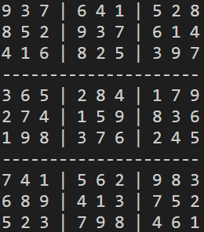

# Sudoku and propositional logic

*Simply run the CircultBoardCSP.py and MapColoringCSP.py to see the output of the required task.*
*For extension a trial is implemented in SectionAssignmentCSP.py*
*You could generate a new student list by running StudentListGenerator.py!*

Solving Sudoku can be mapped to a propositional logic satisfiability problem. This report will guide you through how I used the GSAT and WalkSAT algorithms, both stochastic search algorithms for the SAT problem, to tackle Sudoku.

## Concepts

### 1. CNF (Conjunctive Normal Form):

A CNF formula is a conjunction of one or more clauses, where each clause is a disjunction of literals. The provided `.cnf` files for this assignment contain such clauses. Each line in the `.cnf` file represents a clause.

### 2. Variables:

For a 9x9 Sudoku board, the variable `ijk` represents that cell `(i, j)` has value `k`. Therefore, we have 729 possible variables for a Sudoku board.

### 3. GSAT (Generalized Satisfiability):

This algorithm starts with a random assignment and then iteratively refines it. In each iteration, a variable is chosen and flipped to maximize the number of satisfied clauses. Original description:

1. <u>Choose a random assignment (a model).</u>
2. <u>If the assignment satisfies all the clauses, stop.</u>
3. <u>Pick a number between 0 and 1. If the number is greater than some threshold h, choose a variable uniformly at random and flip it; go back to step 2.</u>
4. <u>Otherwise, for each variable, score how many clauses would be satisfied if the variable value were flipped.</u>
5. <u>Uniformly at random choose one of the variables with the highest score. (There may be many tied variables.) Flip that variable. Go back to step 2.</u>

### 4. WalkSAT:

Similar to GSAT but with a slight variation: it picks an unsatisfied clause at random and then flips one of its literals. The decision of which literal to flip is based on either a random choice or the one that results in the most satisfied clauses.


## Implementation Details

The SAT solver is designed to be generic, allowing for its use in solving different CNF problems beyond just Sudoku. Here's a brief overview of the code structure:

### 1. Variable Generation:

The function `_generate_variables()` creates 729 variables for a 9x9 Sudoku grid. Each variable is a string in the format `ijk`, where `i` is the row, `j` is the column, and `k` is the number (from 1 to 9).

### 2. CNF Loading:

The function `_load_clauses()` reads the given `.cnf` file and loads its clauses.

### 3. WalkSAT:

The `walksat()` function implements the WalkSAT algorithm. At each iteration, the function checks if all clauses are satisfied. If not, a variable from an unsatisfied clause is chosen and flipped based on certain criteria.

Here's a code snippet to showcase the WalkSAT implementation:

```python
def walksat(self):
    values = self._initialize_values()
    for count in range(100000):
        true_clauses_count = self._count_true_clauses(values, self.clauses)
        if true_clauses_count == len(self.clauses):
            self.index_val = values
            return True
        false_clause = random.choice([clause for clause in self.clauses if not self._evaluate_clause(clause, values)])
        if random.random() > 0.9:
            flip_var = abs(random.choice(false_clause))
        else:
            flip_var = max((var for var in false_clause),
                           key=lambda var: self._count_true_clauses(self._flip_value(values, var), self.clauses))
        values[flip_var] = not values[flip_var]
    return False
```

### 4. GSAT:

The `gsat()` function embodies the GSAT algorithm. It tries to flip a variable that would result in the maximum number of satisfied clauses.

Here's a code snippet to showcase the GSAT implementation:

```python
def gsat(self):
    """
    Implement the GSAT algorithm.
    At each step, the algorithm flips the variable that results in the most 
    clause satisfactions. With a small probability, a random variable is chosen.
    """
    values = self._initialize_values()
    for count in range(100000):
        true_clauses_count = self._count_true_clauses(values, self.clauses)
        print(f"Iteration {count + 1}: {true_clauses_count} true clauses out of {len(self.clauses)}")
        if true_clauses_count == len(self.clauses):
            self.index_val = values
            return True
        if random.random() > 0.8:
            flip_var = random.randint(1, SAT.TOTAL_VARS)
        else:
            flip_var = max(range(1, SAT.TOTAL_VARS+1),
                        key=lambda var: self._count_true_clauses(self._flip_value(values, var), self.clauses))
        values[flip_var] = not values[flip_var]
    return False
```

### 5. Helper Functions:

There are several helper functions like `_evaluate_clause()` and `_count_true_clauses()` that are used to evaluate if a clause is satisfied given the current assignment and to count the total number of satisfied clauses, respectively.


## Results

- `one_cell.cnf`: rules that ensure that the upper left cell has exactly one value between 1 and 9.

  

- `all_cells.cnf`: rules that ensure that all cells have exactly one value between 1 and 9.

  

- `rows.cnf`: rules that ensure that all cells have a value, and every row has nine unique values.

  

- `rows_and_cols.cnf`: rules that ensure that all cells have a value, every row has nine unique values, and every column has nine unique values.

  

- `rules.cnf`: adds block constraints, so each block has nine unique values. (The complete rules for an empty sudoku board.)

  

- `puzzle1.cnf`: Adds a few starting values to the game to make a puzzle.

  

- `puzzle2.cnf`: Some different starting values.

  

- `puzzle3.cnf`: Several starting values.

  

## Conclusions & Findings:

1. Both GSAT and WalkSAT are capable of solving the easier puzzles. For harder puzzles, WalkSAT tends to outperform GSAT but may require a significant number of iterations.
2. WalkSAT's approach of focusing on unsatisfied clauses seems to make it more efficient for harder problems.
