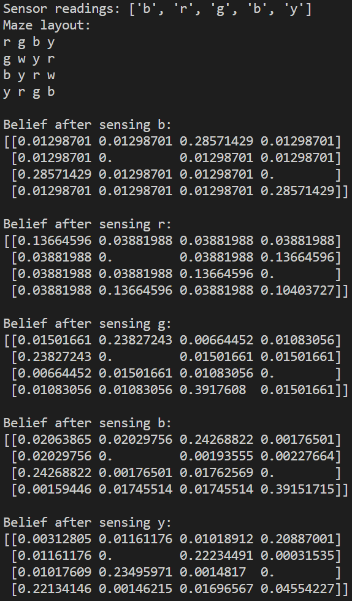
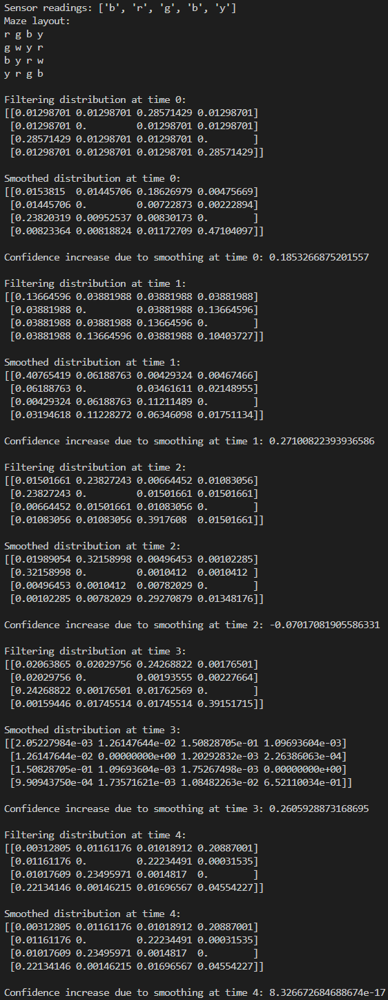
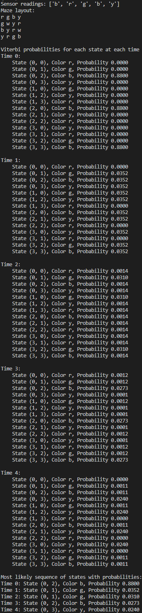

#### Markov Decision Processes and Robot motion planning

*For the basic test, simply run the filtering.py;*
*For the extension, run forward_backward_smoothing.py and viterbi.py respectively*
*All the mazes are hard-coded, so if you want to try other mazes and observation sequence, you can just change them in the code.*

## 1. Problem Summary

We have a robot in a 4x4 maze without any internal walls. The robot's state, represented by the variable X, can be one of 16 possible locations, labeled 0 through 15. The robot starts with a uniform probability distribution over these locations since it doesn't know where it is.

### Key Points

1. **Movement**: The robot moves in one of four directions (North, South, East, West) randomly, one move per time step. If the movement is towards the maze's boundary where it cannot move further, the robot remains in the same location.
2. **Sensing**: Each cell in the maze has a color (red, green, yellow, blue). The robot has a sensor pointing downwards to detect the color of the cell it's currently in. The sensor readings are mostly correct but with a chance of error:
   - Correct color: 88% probability.
   - Each incorrect color: 4% probability.
3. **Task**: Given a sequence of sensor readings, we need to compute a sequence of probability distributions for the robot's location at each time step, updating its belief based on the color detected.

## 2. Models

### State Transition Model

The state transition model describes the robot's movement in the maze and defines the probability distribution over future states given the current state. In the context of a 4x4 grid maze where the robot chooses its direction uniformly at random:

- From any given cell (except for those on the boundary), the robot has four possible moves: North, South, East, or West.
- If the robot is on a boundary cell and chooses to move off the grid, it will stay in the same cell with that probability.

For a grid cell not on the boundary, the state transition probabilities are:

- To the North cell: 0.25 (if not on the North boundary)
- To the South cell: 0.25 (if not on the South boundary)
- To the East cell: 0.25 (if not on the East boundary)
- To the West cell: 0.25 (if not on the West boundary)
- Stay in place (if on any boundary and moving outside): Sum of probabilities for any direction that would move it outside the grid.

### Sensor Model

The sensor model defines the probability of observing a given sensor reading from a particular state. Since the robot's sensor can detect the color of the cell it's currently in (albeit with some error), the probabilities are:

- Correct color detected: 0.88
- Each incorrect color detected: 0.04

This model is symmetric for each color; that is, the probability distribution over sensor readings is the same regardless of the actual color of the cell the robot is in.

## 3. Filtering Algorithm

The filtering algorithm, also known as Bayesian filtering, is used to update the robot's belief about its current state (location) based on the state transition model and sensor readings over time. It involves two steps, predict (time update) and update (measurement update), iteratively applied at each time step:

1. **Prediction Step**

   For each possible location in the grid, calculate the predicted belief by summing over all possible previous locations, multiplying the probability of being in that previous location by the probability of moving to the current location. This prediction incorporates the system dynamics but not the new sensor reading.

2. **Update Step**

   Once a new sensor reading is obtained, the predicted belief is updated using the sensor model. For each cell, multiply the predicted belief by the probability of observing the sensor reading if the robot were in that cell. This step incorporates the new evidence into our belief about the robot's location.

3. **Normalization**

   After the update step, the new belief distribution will generally not sum to 1, so it must be normalized by dividing each probability by the sum of all probabilities in the new belief distribution.

### Implementation Steps

- Initialize the belief state as a uniform distribution since the robot's initial location is unknown.
- For each time step and for each cell in the grid:
  - **Predict** the next state based on the transition model.
  - **Update** the belief state using the sensor model with the color detected by the sensor.
  - **Normalize** the updated belief state so that the sum of all probabilities equals 1.
- Output the belief state after each sensor reading to show how the robot's belief about its location evolves over time.

## 4. Implementation

### 1) Initialization

- The first step is to define the environment in which the robot operates. I represent the maze and its colors in a manner that can be easily translated into a probability distribution. The maze is defined as a 2D list `maze_colors`, where each cell can either contain a color ('r', 'g', 'b', 'y') or a wall ('w'). The maze's structure and the cells' colors are inputs to the localization algorithm.

  ```python
  maze_colors = [
      ['r', 'g', 'b', 'y'],
      ['g', 'w', 'y', 'r'],
      ['b', 'y', 'r', 'w'],
      ['y', 'r', 'g', 'b']
  ]
  ```

- Sensor readings are given in a sequence `sensor_readings_sequence`.

  ```python
  sensor_readings_sequence = ['b', 'r', 'g', 'b', 'y']
  ```

- A dictionary `sensor_accuracy` defines the probability of the sensor detecting each color when the robot is actually on a square of that color. This sensor model accounts for the probability of correct readings and misreadings.

  ```python
  sensor_accuracy = {
      'r': {'r': 0.88, 'g': 0.04, 'b': 0.04, 'y': 0.04},
      'g': {'r': 0.04, 'g': 0.88, 'b': 0.04, 'y': 0.04},
      'b': {'r': 0.04, 'g': 0.04, 'b': 0.88, 'y': 0.04},
      'y': {'r': 0.04, 'g': 0.04, 'b': 0.04, 'y': 0.88}
  }
  ```

### 2) Functions

- The `transition_model` function calculates the robot's new state based on its current state and an action to move North, South, East, or West. This model also accounts for the boundaries of the maze and the walls, ensuring the robot does not move through walls or out of bounds.

  ```python
  def transition_model(state, action, maze):
      # Map actions to changes in position
      action_effects = {
          'N': (-1, 0),
          'S': (1, 0),
          'E': (0, 1),
          'W': (0, -1)
      }
      
      new_state = list(state)
      if action in action_effects:
          dx, dy = action_effects[action]
          new_state[0] += dx
          new_state[1] += dy
  
          # Check for walls or out-of-bounds and revert to original state if move is not possible
          if (new_state[0] < 0 or new_state[0] >= 4 or
              new_state[1] < 0 or new_state[1] >= 4 or
              maze[new_state[0]][new_state[1]] == 'w'):
              new_state = state
      
      return tuple(new_state)
  ```

- I employ a `filtering` algorithm to update our belief about the robot's location over time. Each sensor reading refines this belief, under the assumption that movements are random and sensor readings are noisy. The `filtering` function applies the filtering algorithm. It consists of two steps: prediction and update. The prediction step uses the transition model to determine where the robot might move next, and the update step adjusts the belief distribution based on the sensor reading. After each update, we normalize the distribution to ensure that the sum of probabilities across all states remains 1. This step is necessary because probabilities must sum up to 1 to be valid.

  ```python
  def filtering(sensor_readings, maze):
      # Calculate the number of non-wall squares dynamically
      non_wall_squares = np.sum(maze != 'w')
      initial_belief = 1 / non_wall_squares if non_wall_squares else 0
  
      # Initialize belief distribution
      belief = np.full((4, 4), initial_belief)
      belief[maze == 'w'] = 0  # Walls have zero probability
  
      for reading in sensor_readings:
          # Prediction step (move uniformly in any direction)
          new_belief = np.zeros((4, 4))
          for i in range(4):
              for j in range(4):
                  if maze[i][j] != 'w':  # Ignore walls for prediction
                      for action in ['N', 'S', 'E', 'W']:
                          new_i, new_j = transition_model((i, j), action, maze)
                          new_belief[new_i][new_j] += belief[i][j] * 0.25
          
          # Update step based on sensor reading
          for i in range(4):
              for j in range(4):
                  if maze[i][j] != 'w':  # Walls do not get updated
                      color = maze[i][j]
                      new_belief[i][j] *= sensor_accuracy[color][reading]
          
          # Normalize the belief distribution
          total_belief = np.sum(new_belief)
          if total_belief > 0:
              new_belief /= total_belief
  
          # Print new belief distribution
          print(f"Belief after sensing {reading}:")
          print(new_belief)
          print()
  
          belief = new_belief
  
      return belief
  ```

  The belief distribution, a probability distribution over all possible locations, is initialized uniformly across all non-wall cells and is updated after each sensor reading.

  ```python
  non_wall_squares = np.sum(maze != 'w')
  initial_belief = 1 / non_wall_squares if non_wall_squares else 0
  ```

  #### Example output
  
  

## 5. Extension

### 1) Forward-backward smoothing

Forward-backward smoothing, also known as forward-backward algorithm or Baum-Welch algorithm in the context of Hidden Markov Models (HMMs), is a way to improve the estimation of the state distribution by considering both past observations (forward pass) and future observations (backward pass).

The forward pass is essentially what I have implemented with the `filtering` function: it computes the belief state up to time t given all evidence from time 1 to time t.

The backward pass computes a "backward" message that includes information from future observations. This message is then used to refine the state estimates produced by the forward pass.

Here is an outline of of my extension:

1. **Forward Pass**: Continue using my `filtering` function to compute the forward probabilities (also called forward messages). Store these messages as I compute them for each time step.
2. **Backward Pass**: Create a function to compute the backward messages. This involves iterating over the sensor readings in reverse, starting from the last reading.
3. **Combining Forward and Backward**: Compute the smoothed estimate by multiplying the forward and backward messages for each time step.
4. **Normalization**: Normalize the smoothed estimates so that the probabilities sum up to 1 at each time step.

Below is my implementation of this method:
```python
def backward(sensor_readings, maze):
    # Initialize backward message
    backward_message = np.ones((4, 4))
    backward_messages = [backward_message]

    for reading in reversed(sensor_readings[:-1]):  # No need to compute for first reading
        new_backward_message = np.zeros((4, 4))
        for i in range(4):
            for j in range(4):
                if maze[i][j] != 'w':
                    for action in ['N', 'S', 'E', 'W']:
                        new_i, new_j = transition_model((i, j), action, maze)
                        prob_transition = 0.25  # Since we assume uniform probability of actions
                        prob_sensor = sensor_accuracy[maze[new_i][new_j]][reading]
                        new_backward_message[i][j] += prob_transition * prob_sensor * backward_message[new_i][new_j]
        
        # Normalize the backward message
        new_backward_message /= np.sum(new_backward_message)
        backward_messages.insert(0, new_backward_message)
        backward_message = new_backward_message

    return backward_messages

def forward_backward(sensor_readings, maze):
    forward_messages = filtering(sensor_readings, maze)
    backward_messages = backward(sensor_readings, maze)

    # Smooth the estimates
    smooth_estimates = []
    for t in range(len(sensor_readings)):
        smooth_estimate = forward_messages[t] * backward_messages[t]
        smooth_estimate /= np.sum(smooth_estimate)
        smooth_estimates.append(smooth_estimate)

    return smooth_estimates
```

#### Example output

I compute the maximum probability (the confidence) in the belief state for each method to illustrate the smoothing effect.  We could see that in most of the cases the smoothing algorithm shows higher confidence due to incorporating more information. 



#### Analysis of Results

1. **Initial Time Step (time 0)**
   - The confidence (the highest probability in the distribution) in the robot's location after filtering is lower than the confidence after smoothing. This indicates that smoothing provides a more definitive estimate of the robot's position, as it incorporates both the past and the future sensor readings.
   - The increase in confidence due to smoothing is approximately 0.1853, which is significant and shows the benefit of using additional information from future observations.
2. **Middle Time Steps (time 1 to 3)**
   - At each intermediate time step, the smoothing estimates generally have a higher confidence score than the filtering estimates. This again demonstrates the value of the smoothing process.
   - For time 2, the confidence actually decreases slightly after smoothing. This can happen if future observations introduce evidence that conflicts with the strong beliefs formed by the initial observations. This decrease is a sign that smoothing is revising beliefs in light of new information, which may initially appear as a decrease in confidence but is actually a more accurate representation of uncertainty given the full set of observations.
3. **Final Time Step (time 4)**
   - At the last time step, the smoothed distribution is identical to the filtered distribution. This is expected because there are no future observations beyond this point, so the smoothing process has no additional information to incorporate. The confidence increase is effectively zero, indicating no change from filtering to smoothing.

#### Conclusion

- **Higher Confidence**: The smoothing process generally results in a higher confidence in the state estimates at each time step, except in cases where future observations provide conflicting information.
- **Reduced Overconfidence**: In the case of time step 2, the reduction in confidence due to smoothing might seem counterintuitive, but it actually reflects a reduction in overconfidence. Filtering can sometimes lead to overly confident estimates when the sensor readings align too well with the prior beliefs, which can be tempered by considering the full set of observations.
- **Last Time Step**: Since smoothing cannot add any new information at the last time step, the distributions remain the same as with filtering alone.

### 2) Compute the most likely sequence of robot locations

1. **Initialization of the Maze and States**

   - The maze is structured as a 2D NumPy array with walls.

   - It calculates the total number of valid states (`n_states`) by subtracting the number of walls from the total number of grid cells.

   - Two dictionaries are created, `state_to_idx` and `idx_to_state`, which map the maze's grid coordinates to a unique state index and vice versa, excluding wall locations.

     ```python
     rows, cols = maze.shape
         n_states = rows * cols - np.sum(maze == 'w')  # number of valid (non-wall) states
     
         # Create a mapping from maze (row, col) to state index and back
         state_to_idx = {}
         idx_to_state = {}
         counter = 0
         for i in range(rows):
             for j in range(cols):
                 if maze[i, j] != 'w':  # Ignore wall states
                     state_to_idx[(i, j)] = counter
                     idx_to_state[counter] = (i, j)
                     counter += 1
     
     ```

2. **Viterbi Matrices**

   - `V` is the Viterbi matrix, where each row corresponds to a state and each column to a time step. It stores the highest probability of the most likely sequence of states leading up to that state at each time step.

   - `P` is a path pointer matrix that stores the index of the previous state in the most likely sequence leading up to each state.

     ```python
     V = np.zeros((n_states, len(sensor_readings)))  # Viterbi probability matrix
         P = np.zeros((n_states, len(sensor_readings)), dtype=int)  # Path pointer matrix
     ```

3. **Initialization of Probabilities**

   - The first column of `V` is initialized with the probabilities derived from the sensor model based on the first sensor reading. We assign a probability to each state based on whether the color in that state matches the first reading.

     ```python
     for (i, j), idx in state_to_idx.items():
             V[idx, 0] = sensor_accuracy[maze[i, j]][sensor_readings[0]] if maze[i, j] == sensor_readings[0] else 0
     ```

4. **Recursion Step**

   - We iterate through each time step, starting from the second sensor reading.

   - For each state, we calculate the highest probability (`max_prob`) of arriving at that state from any of the previous states, considering the sensor reading at that time step.

   - We multiply the probability of the most likely previous state (stored in `V`) by the transition probability (assumed to be 1 for any state transition) and the probability of observing the current sensor reading given the current state (from `sensor_accuracy`).

   - We store the calculated highest probability and the index of the corresponding previous state in `V` and `P`, respectively.

     ```python
     for t in range(1, len(sensor_readings)):
             for (i, j), idx in state_to_idx.items():
                 if maze[i, j] != 'w':
                     max_prob = -1
                     max_state = -1
                     for action in ['N', 'S', 'E', 'W']:
                         new_i, new_j = transition_model((i, j), action, maze)
                         if maze[new_i, new_j] != 'w':
                             prev_idx = state_to_idx[(new_i, new_j)]
                             prob_transition = 1  # Assuming equal transition probability
                             prob_sensor = sensor_accuracy[maze[i, j]][sensor_readings[t]]
                             prob = V[prev_idx, t-1] * prob_transition * prob_sensor
                             if prob > max_prob:
                                 max_prob = prob
                                 max_state = prev_idx
                     V[idx, t] = max_prob
                     P[idx, t] = max_state
     ```

5. **Termination Step**

   - After processing all sensor readings, it identifies the last state with the highest probability from the last column of `V`.

     ```python
     last_idx = np.argmax(V[:, -1])
         path = [idx_to_state[last_idx]]
     ```

6. **Path Tracing**

   - Starting from the last state, it traces back through the `P` matrix to identify the most likely sequence of states that the robot traveled through.

   - It inserts each identified state at the beginning of the `path` list to ensure the path is in the correct order, from the first to the last state.

     ```python
     for t in range(len(sensor_readings) - 1, 0, -1):
             last_idx = P[last_idx, t]
             path.insert(0, idx_to_state[last_idx])
     
         return path, V, state_to_idx
     ```

#### Example output

