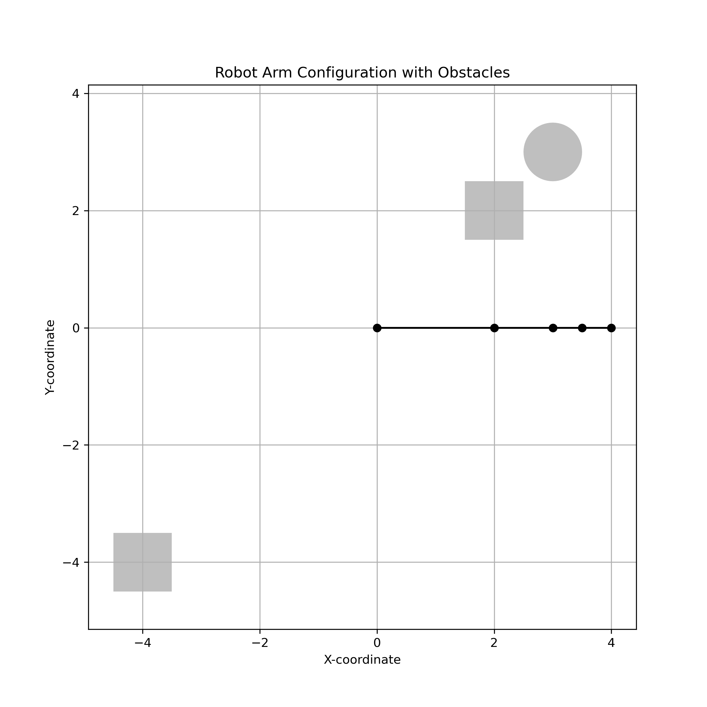

# Motion planning with PRM and RRT

*Simply run test.py to see all the results, extension(ann and KDtree for roadmap construction) is included in the prm.py*

## Problem Formulation

### Introduction

This project focuses on implementing motion planners for two distinct robotic systems: a planar robot arm and a steered car. The planar robot arm is defined by the angles of its joints, while the state of the steered car is characterized by its x,y location and the angle it makes with the horizontal axis.

## Kinematics

The first step involves writing a simulator that computes the locations of the endpoints of the robot arm's links for a given configuration specified by the angles θ1…θn. This is achieved using standard forward kinematics for planar robot arms. The position of each joint (and thus the endpoint of each link) is calculated by accumulating the transformations due to each joint's rotation, starting from the base at (0,0).

The function `compute_end_points` takes in the lengths of the links and the joint angles and returns the coordinates of the end of each link. This is essential for determining whether the robot arm is in a valid configuration that does not collide with any obstacles.

```python
def compute_end_points(link_lengths, angles):
    """
    Computes the end points of each link in a planar robot arm.
    
    Args:
    - link_lengths (list): A list of lengths for each link in the robot arm.
    - angles (list): A list of angles (in radians) for each joint in the robot arm.

    Returns:
    - List of tuples: Each tuple represents the (x, y) coordinates of the end point of each link.
    """

    # Initialize the starting point of the arm.
    x, y = 0, 0

    # List to store the end points of each link.
    end_points = [(x, y)]

    # Accumulate the angle as we move through each joint.
    total_angle = 0

    for length, angle in zip(link_lengths, angles):
        total_angle += angle
        x += length * np.cos(total_angle)
        y += length * np.sin(total_angle)
        end_points.append((x, y))

    return end_points
```


## Collision Checking

Once the kinematics are computed, it is crucial to check for any collisions between the robot arm and the obstacles. The function `check_collision` performs this check by creating line segments for each link in the robot arm and checking for intersections with any of the obstacles in the workspace, represented by Shapely objects.

```python
def check_collision(link_end_points, obstacles):
    """
    Checks if there is a collision between the robot arm and any of the obstacles.

    Args:
    - link_end_points (list of tuples): The end points of each link in the robot arm.
    - obstacles (list of Shapely objects): The obstacles in the workspace.

    Returns:
    - bool: True if there is a collision, False otherwise.
    """
    
    # Create line segments for each link in the robot arm
    arm_segments = [LineString([link_end_points[i], link_end_points[i+1]]) for i in range(len(link_end_points) - 1)]

    for segment in arm_segments:
        for obstacle in obstacles:
            if segment.intersects(obstacle):
                return True  # Collision detected

    return False  # No collision detected
```


## Visualization

The visualization is handled by the `draw_robot_arm` function, which plots the robot arm and obstacles using Matplotlib. This function is vital for visual feedback during development and for the verification of the robot's configurations and paths.

```python
def draw_robot_arm(end_points, obstacles=None, collision=False):
    """
    Draws the robot arm with the obstacles and indicates collisions.
    The base of the arm will be at location (0, 0).

    Args:
    - end_points (list of tuples): The end points of each link in the robot arm.
    - obstacles (list of Shapely objects): The obstacles in the workspace.
    - collision (bool): True if there is a collision, False otherwise.
    """
    
    # Unzip the end points into separate x and y coordinate lists.
    x_coords, y_coords = zip(*end_points)

    # Initialize plot
    fig, ax = plt.subplots(figsize=(8, 8))

    if collision:
        fig.patch.set_facecolor('#ffcccb')

    # Draw the robot arm
    ax.plot(x_coords, y_coords, marker='o', color='red' if collision else 'black')

    # Draw the obstacles
    if obstacles:
        for obstacle in obstacles:
            x, y = obstacle.exterior.xy
            ax.fill(x, y, alpha=0.5, fc='gray')

    plt.title("Robot Arm Configuration" + (" with Obstacles" if obstacles else "") + (" - Collision Detected" if collision else ""))
    plt.xlabel("X-coordinate")
    plt.ylabel("Y-coordinate")
    plt.grid(True)
    plt.axis("equal")

    # Show the plot
    plt.show()

    return fig, ax
```

**Initialization**



**RoadMap**


**Path**


### PRM Algorithm

The PRM algorithm comprises two phases:

1. **Roadmap Generation**: A graph is constructed where vertices represent valid (collision-free) configurations, and edges represent feasible paths between them. The process involves:

   - **Sampling Method**: Random configurations are sampled in the configuration space.

   - **Collision Detection**: Each sampled configuration is checked for collisions with obstacles.

   - **Local Planner**: Attempts to connect a vertex to its k nearest neighbors, ensuring the path between them is collision-free.

   - ```python
     class PRMPlanner:
         def __init__(self, link_lengths, num_samples, k, obstacles):
             self.link_lengths = link_lengths
             self.num_samples = num_samples
             self.k = k
             self.obstacles = obstacles
             self.graph = nx.Graph()
         
         def sample_configurations(self):
             """
             Randomly samples configurations in the configuration space.
             """
             configs = []
             for _ in range(self.num_samples):
                 # Random angles for each joint
                 angles = [np.random.uniform(0, 2 * np.pi) for _ in self.link_lengths]
                 # Check if the configuration is in collision
                 if not check_collision(compute_end_points(self.link_lengths, angles), self.obstacles):
                     configs.append(angles)
             return configs
     ```

2. **Query Phase**: Given a start and goal configuration, the planner searches the roadmap for a feasible path.

​	All the test is in the test.py

# Extension: PRM Planner Performance: KDtree vs. ANN-based Methods

## Methods

1. **KDtree Method**: Efficient for nearest neighbor searches, particularly in lower dimensions.

2. **ANN-based Method**: Uses an Approximate Nearest Neighbor algorithm, potentially faster for very large datasets or higher dimensions but may compromise on precision.

   ```python
       def build_roadmap(self):
           """
           Builds the roadmap as a graph where vertices represent non-colliding configurations
           and edges represent feasible paths between them.
           """
           # Sample configurations
           configs = self.sample_configurations()
           
           # Add configurations as nodes in the graph
           for config in configs:
               self.graph.add_node(tuple(config))
           
           # Create a KDTree for efficient nearest neighbor search
           tree = KDTree(configs)
           
           # Connect each node to its k nearest neighbors
           for config in configs:
               distances, indices = tree.query(config, k=self.k+1)  # +1 because query includes the node itself
               for i, index in enumerate(indices):
                   if i > 0:  # Skip the first index because it's the node itself
                       neighbor = configs[index]
                       if not nx.has_path(self.graph, tuple(config), tuple(neighbor)):
                           # Check if path between config and neighbor is collision-free
                           if self.is_collision_free_path(config, neighbor):
                               self.graph.add_edge(tuple(config), tuple(neighbor), weight=distances[i])
   
       def build_roadmap_ann(self):
           """
           Builds the roadmap using an Approximate Nearest Neighbor (ANN) algorithm.
           """
           # Sample configurations
           configs = self.sample_configurations()
   
           # Convert configurations to a numpy array for ANN
           config_array = np.array(configs)
   
           # Use sklearn's NearestNeighbors to find the k nearest neighbors
           nbrs = NearestNeighbors(n_neighbors=min(len(configs), self.k+1), algorithm='auto').fit(config_array)
   
           # Add configurations as nodes in the graph
           for config in config_array:
               self.graph.add_node(tuple(config))
   
           # Find k nearest neighbors for each node
           distances, indices = nbrs.kneighbors(config_array)
   
           # Connect each node to its k nearest neighbors
           for idx, config in enumerate(config_array):
               for neighbor_index in indices[idx][1:]:  # Skip the first index because it's the node itself
                   neighbor = config_array[neighbor_index]
                   # Check if path between config and neighbor is collision-free
                   if self.is_collision_free_path(config, neighbor):
                       # Add an edge if the path is collision-free
                       self.graph.add_edge(tuple(config), tuple(neighbor), weight=distances[idx][np.where(indices[idx] == neighbor_index)][0])
   ```

   

## Results

| k    | Method    | Build Time | Path Found | Path Length |
| ---- | --------- | ---------- | ---------- | ----------- |
| 5    | KDtree    | 0.444809   | TRUE       | 4           |
| 5    | ANN-based | 1.515078   | TRUE       | 3           |
| 10   | KDtree    | 0.557123   | TRUE       | 7           |
| 10   | ANN-based | 2.816734   | TRUE       | 7           |
| 15   | KDtree    | 0.667366   | TRUE       | 3           |
| 15   | ANN-based | 4.217433   | TRUE       | 5           |
| 50   | KDtree    | 1.602746   | TRUE       | 4           |
| 50   | ANN-based | 13.84858   | TRUE       | 6           |

### Observation of Build Time

- **Overall Trend**: The build time increases with the increase in 'k' for both methods.
- **KDtree vs. ANN**: KDtree consistently shows lower build times compared to the ANN-based method. This indicates a higher efficiency of KDtree in handling the task's complexity and data size.

### Path Found

- **Success Rate**: Both methods successfully found paths in all instances, indicating that both are effective in navigating the configuration space and avoiding obstacles.

### Path Length

- The path length varies with different 'k' values and between methods.
- **Lower 'k' Values**: At 'k' = 5, the ANN-based method found a shorter path compared to KDtree. This might indicate a better exploration of the configuration space with fewer neighbors.
- **Higher 'k' Values**: At 'k' = 15 and 50, KDtree tends to find shorter or equal-length paths compared to ANN. This could be due to more comprehensive coverage and connection of the configuration space.

## Discussion

### Efficiency

- The KDtree method is more efficient time-wise, likely due to its effectiveness in lower-dimensional spaces and smaller datasets, which aligns with the scenario of our robotic arm planning.

### Path Optimization

- While ANN-based method occasionally finds shorter paths, this is not consistent. The efficiency of path finding doesn't necessarily correlate with shorter paths.
